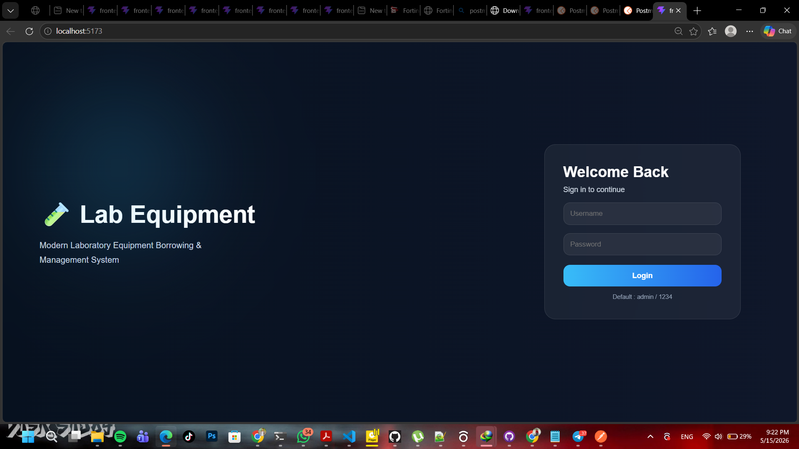
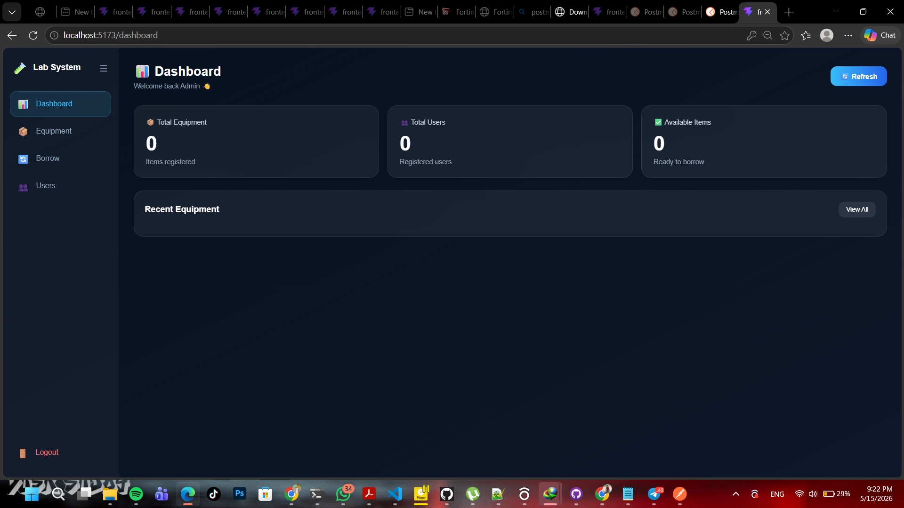
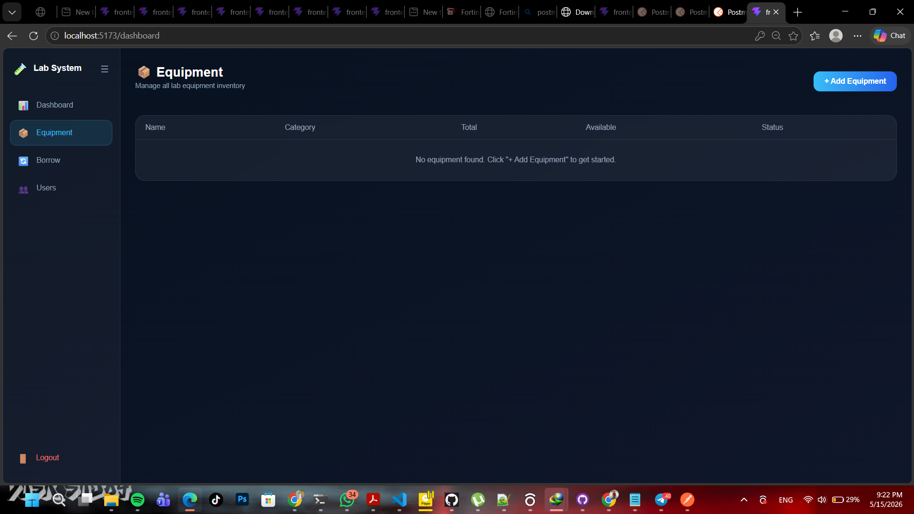
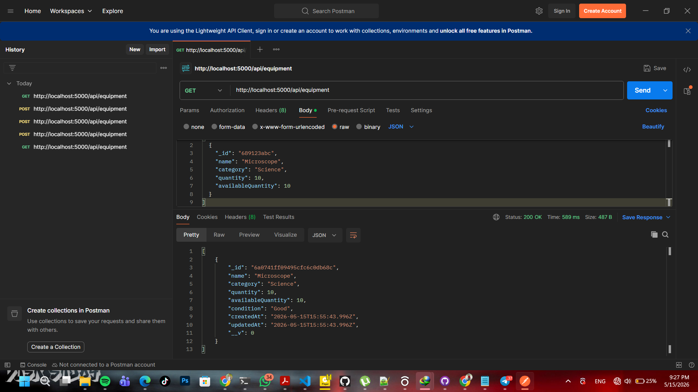
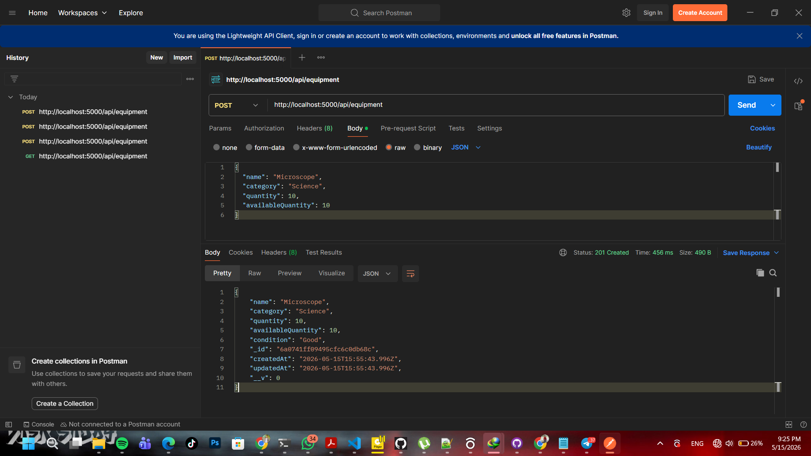
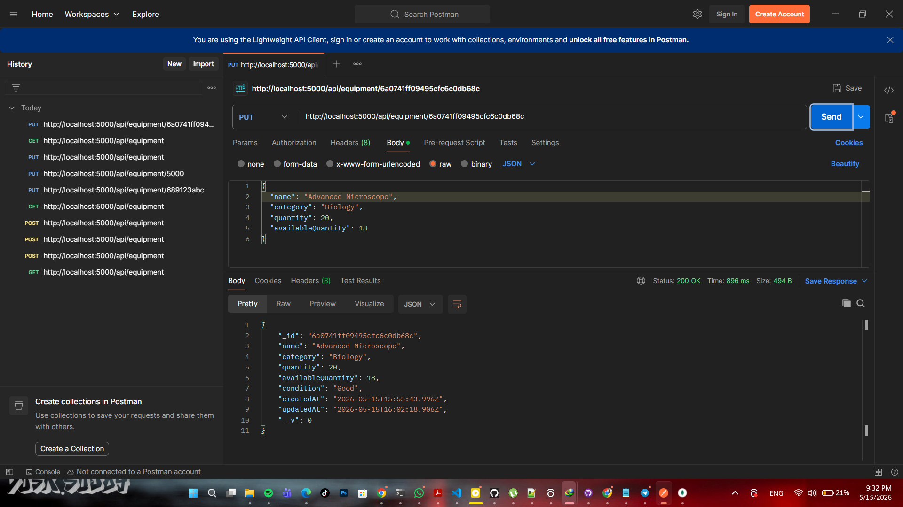
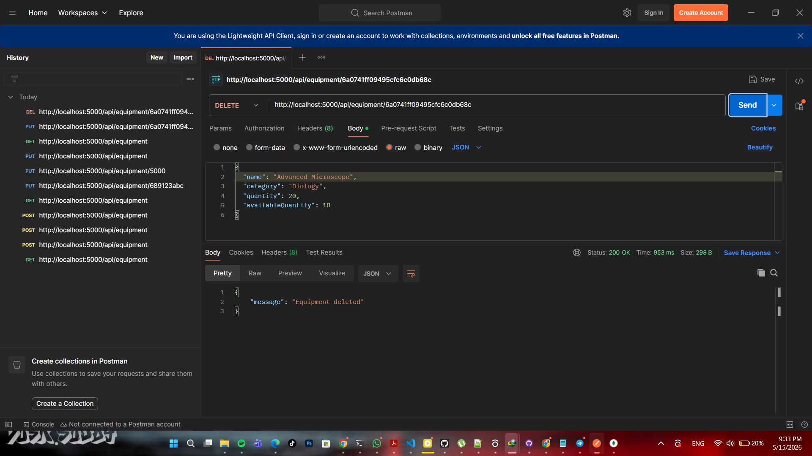
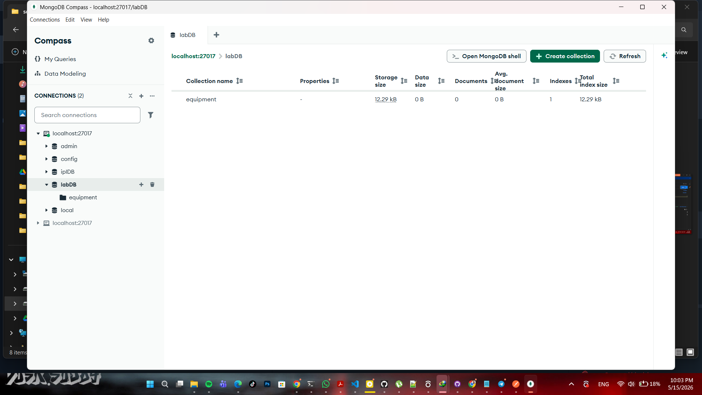

# 🧪 Lab Equipment Borrowing System

A modern full-stack laboratory equipment borrowing and management system developed using the MERN Stack.

---

# 📌 Project Overview

The Lab Equipment Borrowing System was developed to help laboratories and universities manage laboratory equipment efficiently. This system allows administrators to manage equipment, users, and borrowing activities through a modern dashboard interface.

The project includes:

* User-friendly Login System
* Modern Dashboard UI
* Equipment Management
* Borrow Equipment Functionality
* REST API Integration
* MongoDB Database Management
* CRUD Operations using Postman

---

# 🚀 Technologies Used

## Frontend

* React.js
* CSS3
* Axios
* React Router DOM
* Vite

## Backend

* Node.js
* Express.js
* MongoDB
* Mongoose

## Tools

* Postman
* MongoDB Compass
* Visual Studio Code

---

# 📂 Project Structure

```text
Lab-Equpement/
│
├── backend/
│   ├── models/
│   ├── routes/
│   ├── controllers/
│   ├── server.js
│   └── package.json
│
├── frontend/
│   ├── src/
│   │   ├── api/
│   │   ├── pages/
│   │   ├── components/
│   │   ├── App.jsx
│   │   ├── index.css
│   │   └── main.jsx
│   └── package.json
│
└── README.md
```

---

# ⚙️ System Features

## ✅ Authentication

* Secure admin login page
* Username and password validation
* Dashboard redirection after successful login
* Logout functionality

---

## ✅ Dashboard

The dashboard provides:

* Total equipment count
* Total users count
* Available equipment statistics
* Recent equipment list
* Modern responsive UI

---

## ✅ Equipment Management

Administrators can:

* Add new equipment
* View all equipment
* Update equipment
* Delete equipment

---

## ✅ Borrow System

Users can:

* Borrow equipment
* Select quantity
* Update available stock automatically

---

# 📦 Repository

GitHub Repository Link:

```text
https://github.com/YOUR_USERNAME/Lab-Equipment-Borrowing-System
```

Clone the repository:

```bash
git clone https://github.com/YOUR_USERNAME/Lab-Equipment-Borrowing-System.git
```

Navigate into the project:

```bash
cd Lab-Equipment-Borrowing-System
```

---

# 🛠️ Installation Guide

## Step 1 — Clone Project

```bash
git clone https://github.com/YOUR_USERNAME/Lab-Equipment-Borrowing-System.git
cd Lab-Equipment-Borrowing-System
```

---

## Step 2 — Install Backend Dependencies

Open terminal:

```bash
cd backend
npm install
```

---

## Step 3 — Install Frontend Dependencies

Open another terminal:

```bash
cd frontend
npm install
```

---

## Step 4 — Configure MongoDB

Create `.env` file inside backend folder.

```env
MONGO_URI=your_mongodb_connection_string
PORT=5000
```

---

## Step 5 — Start Backend Server

```bash
npm start
```

Expected output:

```text
Connected to MongoDB
Server running on port 5000
```

---

## Step 6 — Start Frontend

```bash
npm run dev
```

Open browser:

```text
http://localhost:5173
```

---

# 🔐 Login Credentials

```text
Username : admin
Password : 1234
```

---

# 📡 API Endpoints

Base URL:

```text
http://localhost:5000/api
```

---

## 📦 Equipment APIs

### 1️⃣ GET All Equipment

```http
GET /api/equipment
```

Response:

```json
[
  {
    "_id": "64f1a2b3c4d5e6f7a8b9c0d1",
    "name": "Microscope X200",
    "category": "Optics",
    "totalQuantity": 8,
    "availableQuantity": 5,
    "description": "High precision optical microscope"
  }
]
```

---

### 2️⃣ POST Add Equipment

```http
POST /api/equipment
```

Request Body:

```json
{
  "name": "Microscope X200",
  "category": "Optics",
  "totalQuantity": 8,
  "availableQuantity": 5,
  "description": "High precision optical microscope"
}
```

Response:

```json
{
  "message": "Equipment added successfully",
  "_id": "64f1a2b3c4d5e6f7a8b9c0d1"
}
```

---

### 3️⃣ PUT Update Equipment

```http
PUT /api/equipment/:id
```

Request Body:

```json
{
  "name": "Microscope X200 Pro",
  "category": "Optics",
  "totalQuantity": 10,
  "availableQuantity": 7,
  "description": "Updated high precision optical microscope"
}
```

Response:

```json
{
  "message": "Equipment updated successfully"
}
```

---

### 4️⃣ DELETE Equipment

```http
DELETE /api/equipment/:id
```

Response:

```json
{
  "message": "Equipment deleted successfully"
}
```

---

## 👥 User APIs

### 1️⃣ GET All Users

```http
GET /api/users
```

Response:

```json
[
  {
    "_id": "64f1a2b3c4d5e6f7a8b9c0d2",
    "name": "Amal Perera",
    "email": "amal@university.lk",
    "role": "Student"
  }
]
```

---

### 2️⃣ POST Add User

```http
POST /api/users
```

Request Body:

```json
{
  "name": "Amal Perera",
  "email": "amal@university.lk",
  "role": "Student"
}
```

Response:

```json
{
  "message": "User added successfully",
  "_id": "64f1a2b3c4d5e6f7a8b9c0d2"
}
```

---

## 🔄 Borrow APIs

### 1️⃣ POST Borrow Equipment

```http
POST /api/borrow
```

Request Body:

```json
{
  "userId": "64f1a2b3c4d5e6f7a8b9c0d2",
  "equipmentId": "64f1a2b3c4d5e6f7a8b9c0d1",
  "quantity": 2,
  "borrowDate": "2025-05-15",
  "returnDate": "2025-05-22"
}
```

Response:

```json
{
  "message": "Equipment borrowed successfully"
}
```

---

## 📋 API Summary Table

| Method | Endpoint | Description |
|--------|----------|-------------|
| GET | /api/equipment | Get all equipment |
| POST | /api/equipment | Add new equipment |
| PUT | /api/equipment/:id | Update equipment |
| DELETE | /api/equipment/:id | Delete equipment |
| GET | /api/users | Get all users |
| POST | /api/users | Add new user |
| POST | /api/borrow | Borrow equipment |

---

# 🧪 Postman Testing

The APIs were tested using Postman.

CRUD operations tested:

* GET
* POST
* PUT
* DELETE

---

# 📸 Screenshots

## 1️⃣ Login Page



Description:

The login page contains a modern dark-blue user interface with secure admin authentication.

---

## 2️⃣ Dashboard



Description:

The dashboard displays analytics cards, recent equipment, and modern admin controls.

---

## 3️⃣ Equipment Management



Description:

This page allows administrators to manage laboratory equipment efficiently.

---

## 4️⃣ Postman GET Request



Description:

The GET request retrieves all equipment records from the MongoDB database.

---

## 5️⃣ Postman POST Request



Description:

The POST request is used to add new equipment into the database.

---

## 6️⃣ Postman PUT Request



Description:

The PUT request updates existing equipment details.

---

## 7️⃣ Postman DELETE Request



Description:

The DELETE request removes equipment from the database.

---

## 8️⃣ MongoDB Compass



Description:

MongoDB Compass displays stored collections such as equipment, users, and borrowing records.

---

# 🧠 Challenges Faced

During the development process, several challenges were encountered:

* Connecting frontend and backend properly
* Managing MongoDB database relationships
* Designing a modern responsive UI
* Handling CRUD operations correctly
* API testing and debugging

These issues were solved through testing, debugging, and improving project structure.

---

# 🎯 Future Improvements

Future enhancements for this project include:

* JWT Authentication
* Role-based access control
* Email notifications
* Equipment image upload
* Borrow history tracking
* Advanced analytics dashboard
* Mobile responsive optimization

---

# ✅ Conclusion

The Lab Equipment Borrowing System successfully demonstrates a complete MERN stack application with authentication, dashboard analytics, CRUD functionality, and REST API integration.

This project improved knowledge in:

* Full-stack web development
* Database management
* REST APIs
* Frontend UI design
* Backend integration
* Software testing

The system provides an efficient and modern solution for laboratory equipment management.

---

# 👨‍💻 Developed By

Name: K.W.A.Gihan Adithya

Registration Number: 2022/ICT/74

University: University of Vavuniya

Module: Web Services and Technology (IT2234)
